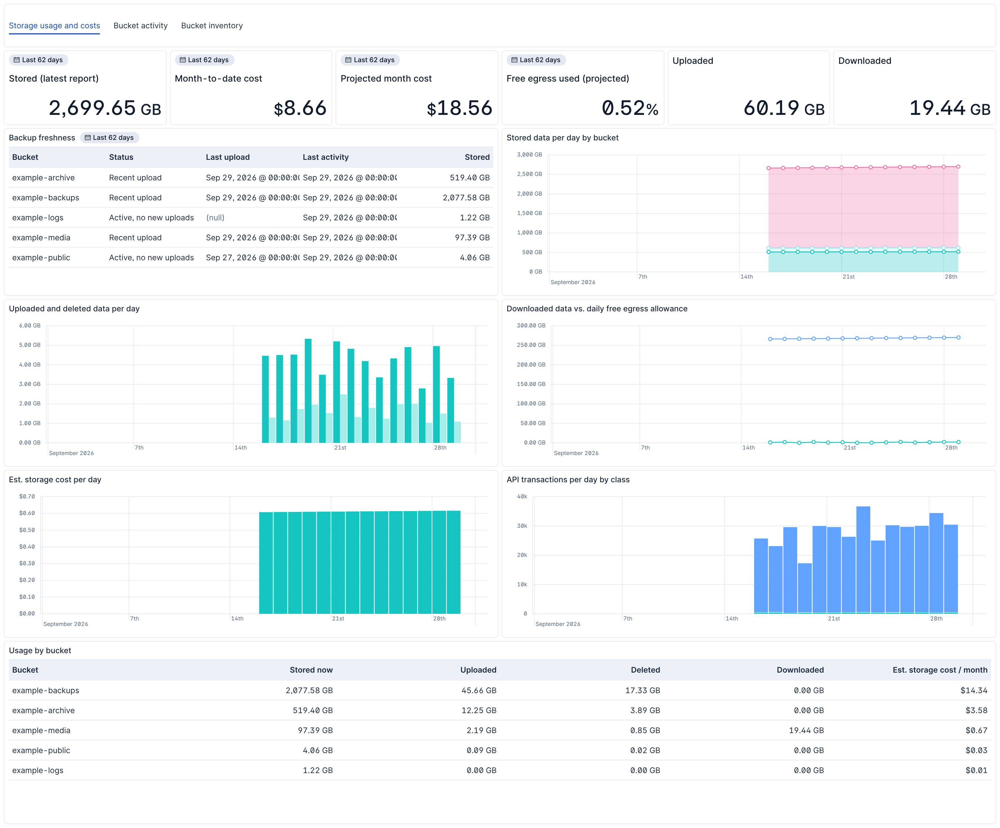
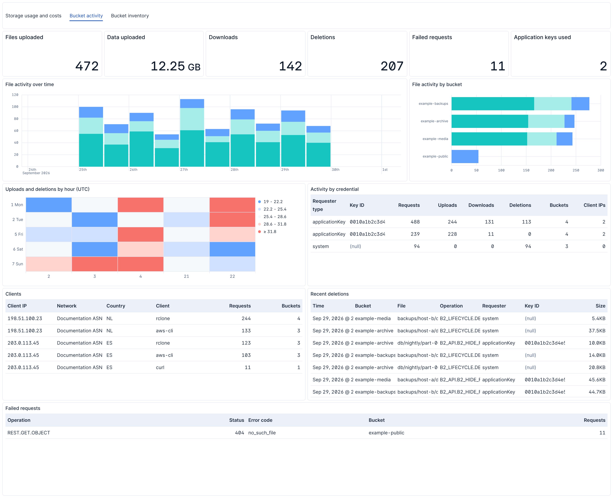
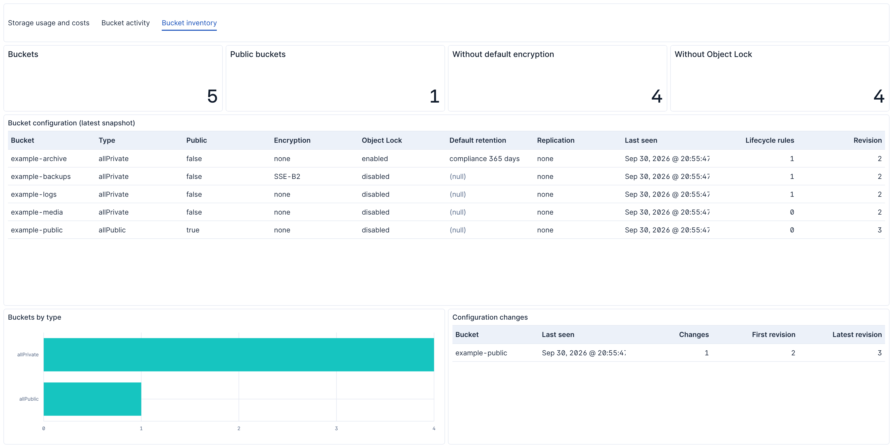

# Backblaze B2 Integration for Elastic

[](https://github.com/NateShoffner/backblaze-b2-elastic-integration/actions/workflows/ci.yml)

An Elastic Agent integration that collects bucket access logs (`access`), daily
usage reports (`usage`), and bucket configuration (`bucket`) from
[Backblaze B2 Cloud Storage](https://www.backblaze.com/cloud-storage).

Logs and reports are read from B2 buckets with the AWS S3 input pointed at the
B2 S3-compatible endpoint; bucket configuration is polled from the B2 Native API
with the CEL input. Requires **Kibana 9.4 or later**.

**[Read the integration documentation](packages/backblaze_b2/docs/README.md)**
for setup steps, configuration options, exported fields, and troubleshooting.

## Dashboards

Storage and cost, bucket activity, and bucket inventory, shown here with
synthetic data:







## Installation

Download the `.zip` from the [latest release](https://github.com/NateShoffner/backblaze-b2-elastic-integration/releases/latest)
and upload it through **Kibana > Integrations > Upload integration**, or:

```sh
elastic-package install --zip backblaze_b2-<version>.zip
```

To build it yourself instead:

```sh
cd packages/backblaze_b2
elastic-package build     # writes build/packages/backblaze_b2-<version>.zip
elastic-package install
```

## Development

Requires [`elastic-package`](https://github.com/elastic/elastic-package) and
Docker. Run from `packages/backblaze_b2`:

```sh
elastic-package check            # lint and build
elastic-package stack up -d -v   # needed by the test commands below
elastic-package test pipeline    # ingest pipeline tests
elastic-package test policy      # agent policy rendering tests
elastic-package test system --data-streams bucket   # end-to-end against a mock B2 API
```

Edit documentation in `_dev/build/docs/README.md`, never in `docs/README.md`,
which is regenerated on every build. Dashboards are exported saved objects in
`kibana/dashboard/`, edited in Kibana and exported with
`elastic-package export dashboards`.

### Releasing

Bump `version` in `packages/backblaze_b2/manifest.yml`, add a matching
`changelog.yml` entry, then push a tag:

```sh
git tag v0.2.0 && git push origin v0.2.0
```

CI verifies the tag matches the manifest version, builds the package, and
publishes a GitHub release with the `.zip` attached and notes drawn from the
changelog entry.

## License

[Elastic License 2.0](LICENSE). Backblaze and B2 are trademarks of Backblaze,
Inc. This project is not affiliated with Backblaze or Elastic.
